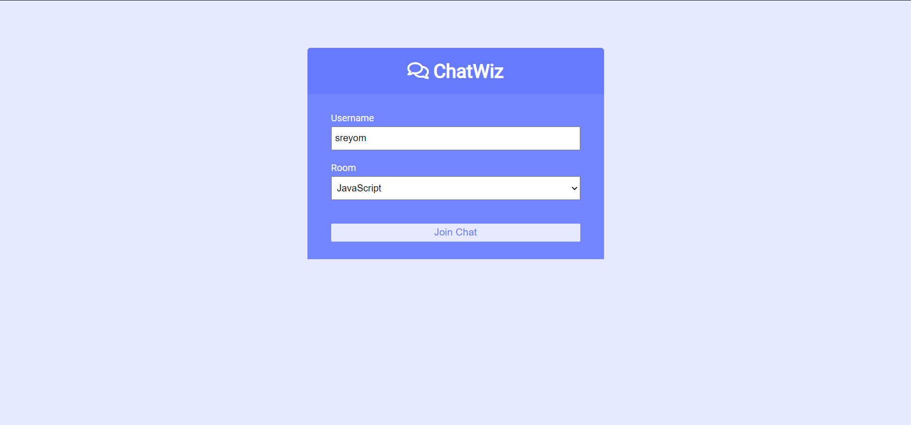
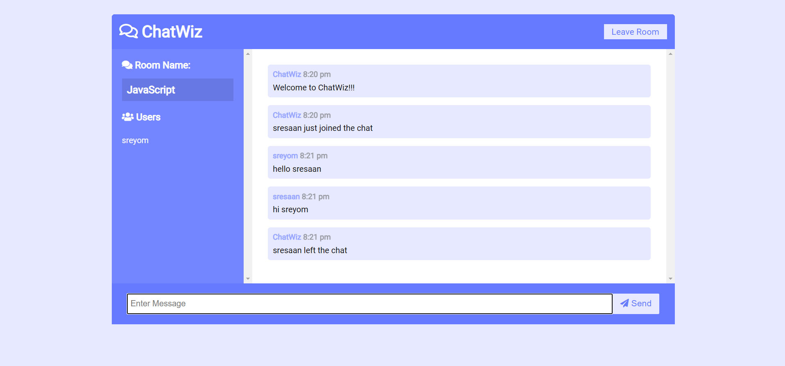

# **ChatWiz App**

`Realtime chat app with websockets using Node.js, Express and Socket.io with Vanilla JS on the frontend with a custom UI.`

## **Landing Page**


## **ChatPage**


## **How to get Started**
---


Clone the repository to your local machine

```bash
git clone <repo-link>
```

Move to the folder
```bash
cd Bundli-Frontend/"Chat App"
```

Install the dependencies
```bash
npm install
```

Run the development environment
```bash
nodemon server.js
Go to localhost:3000
```

