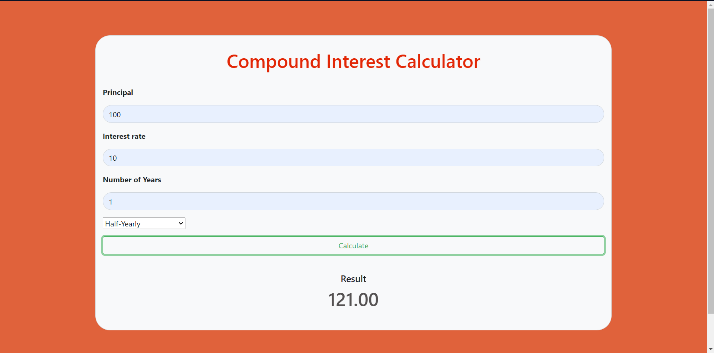

# **Compound Interest Calculator**

`This is a compound interest calculator made using HTML, CSS and vanilla javascript.`

## **Landing Page**


## **How to get Started**
---


Clone the repository to your local machine

```bash
git clone <repo-link>
```

Move to the folder
```bash
cd Bundli-Frontend/"Compound Interest Calculator"
```

Open with live-server (Vscode)
```bash
Click Go Live
```

