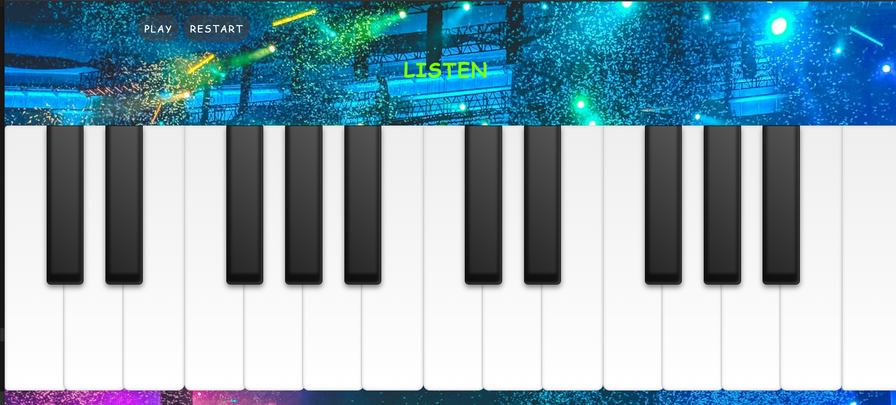
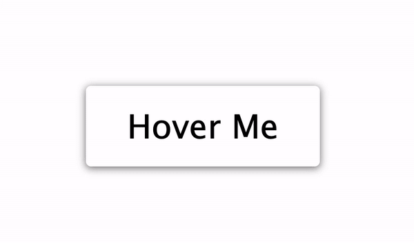
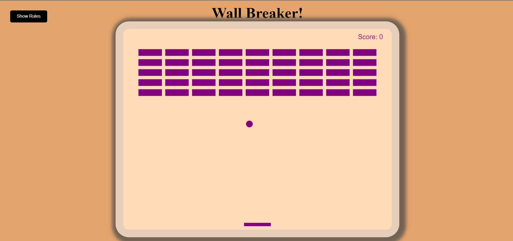
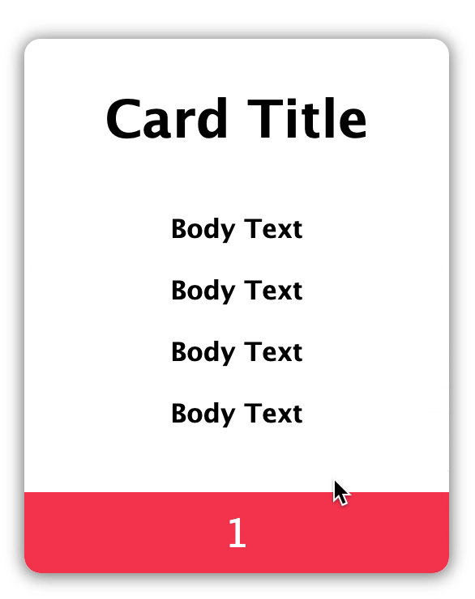
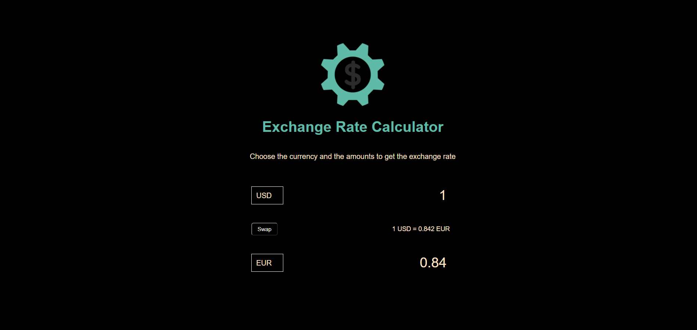
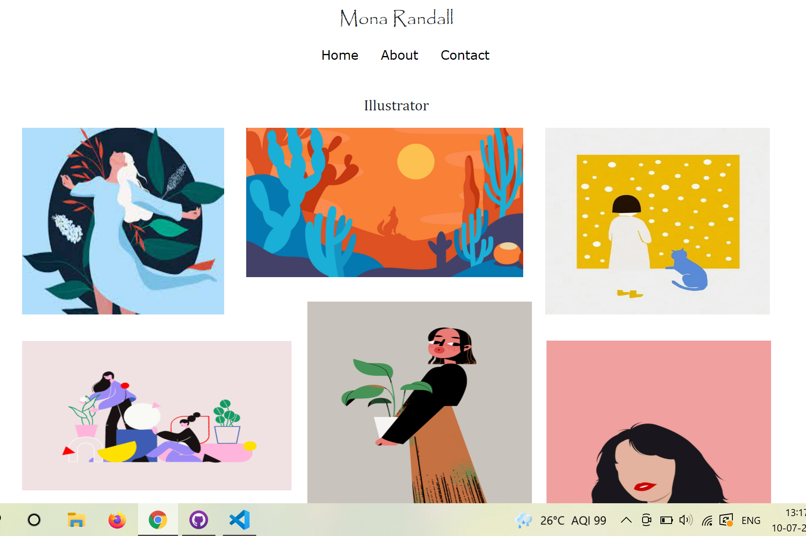
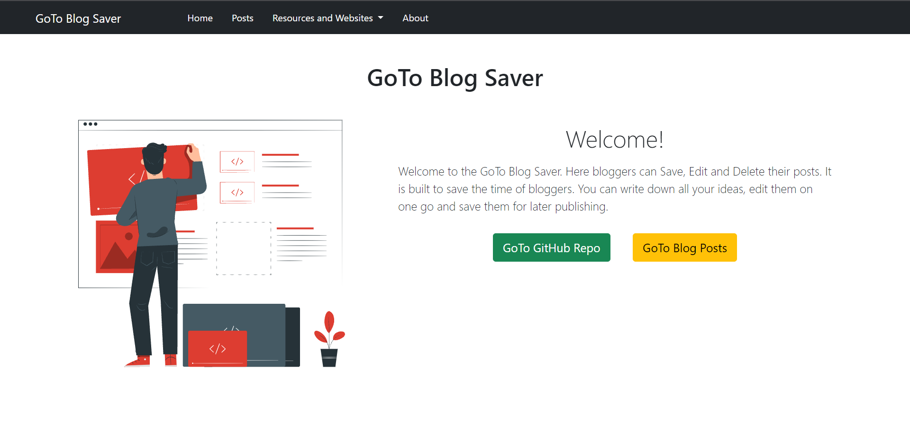
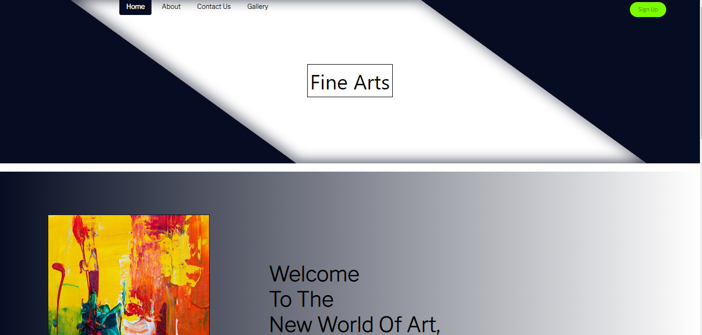

# Bundli-Frontend

Bundli-Frontend is a open source project which contains different code of frontend Development with HTML, CSS, JS, REACT, ANGULAR and APIs etc. which makes your life easier for learning frontend and make your intrest more in frontend.

    

  

### We have also take codes from Udemy,30 days of javascript and many more

## 📌 Introduction

Bundli-Frontend is a repo which contains different code of frontend Development which is written in HTML5, CSS3, JAVASCRIPT and it also contains various codes of frontend libraries like React, Angular and so on.

## ⭐ How to get started?

You can refer to the following articles on the basics of Git and Github and also contact the Project Mentors, in case you are stuck:

- [Watch this video to get started, if you have no clue about open source](https://youtu.be/SL5KKdmvJ1U)
- [Forking a Repo](https://help.github.com/en/github/getting-started-with-github/fork-a-repo)
- [Cloning a Repo](https://help.github.com/en/desktop/contributing-to-projects/creating-a-pull-request)
- [How to create a Pull Request](https://opensource.com/article/19/7/create-pull-request-github)
- [Getting started with Git and GitHub](https://towardsdatascience.com/getting-started-with-git-and-github-6fcd0f2d4ac6)

## 💥 How to Contribute?

- Take a look at the Existing [Issues](https://github.com/Ayush7614/Bundli-Frontend/issues) or create your own Issues!
- Wait for the Issue to be assigned to you after which you can start working on it.
- Fork the Repo and create a Branch for any Issue that you are working upon.
- Create a Pull Request which will be promptly reviewed and suggestions would be added to improve it.
- Add Screenshots to help us know what this Script is all about.
- Having difficulty in contributing? Read the [Contribution Guide](https://github.com/Ayush7614/Bundli-Frontend/blob/main/CONTRIBUTING.md) for a detailed explanation.

## 💻 Languages used in this project

</img>
</img>
</img>

## 💻 Frameworks and libraries used in this project

</img>
</img>
</img>

# Screenshots

### 1 . Drawing App

    

### 2 . Github Profiles

    

### 3 . Insect Catching Game

    

### 4 . Kinectic Loader

    

### 5 . Movie App

    

### 6 . Theme Clock

    

### 7 . Verify Account

    

### 8 . 3d Boxes Background

    

### 9 . Dads Joke

    

### 10 . JS + CSS Clock

    

### 11 . Form Wave

    

### 12 . Drink Water

    

### 13 . Todo App

    

### 14 . Doremon Css

     

### 15 . JS Calculator

     

### 16. Drum-kit

### 17 . Flappy Bird

     

### 18 . Hangman In Js

     

### 19 . Memory Game In Js

     

### 20. Connect Four Game In Js

     

### 21. Simon Game

     

### 22. Color Flipper in JS

     

### 23. Vaccine Slot Finder

     

### 24.Dice Game

     

### 25. Responsive Profile Card View

     

### 26 . Tic-Tac-Toe Game In Js

     

### 27. Carousel In Vanilla JS

     

### 28. Loading Animation

     

### 29. Quiz App In Js

     

### 30. BMI Calculator

     

### 31. Social Media Dashboard

<table>
 <tr>
  <td>
   

     

  </td>
  <td>
   

     

  </td>
 </tr>
</table>

### 32. Glassmorphism animation

     

### 33 . Brick Breakout Game

     

### 34. Spin Wheel

     

### 35. Type Racer Game

     

### 36. Online Code Editor

     

### 37. Password_Generator

     

### 38. Snake Game

     

### 39. Netflix

     

### 40. Notification Button

     

### 41. Guess_The_Color

     

### 42. Guess the Number game

     

### 43. Weather App

     

### 44. Stop Watch

 
 

### 45. Registration Form

     

### 46.Quote_Generator

     

### 47. Transform Toggle Animation

 

     

### 48. Pricing Card Deck

   

     

### 49. Neumorphic Music Player

     
 

### 50. Coin-toss game

     

### 51. Car Driving Animation

     

### 52. Car_Game

     

### 53. Rock-Paper-Scissors

     
 

### 54. Maze Game

     

### 55. Tetris_Game

     

### 56 Payment Gateway Integration

    

### 57. Gradient Background Generator

     

### 58. Glassmorphisam Profile Card

     

### 59. Whack a mole game

     

### 60. Colourful smoke effect

     

### 61. Find the word game

     

### 62. Rising_Bars_Game

     

### 63. Simple Chatroom

     

### 64. Notes App

     

### 65. Google Clone

     

### 66. Minesweeper Game

     

### 67. Admin Dashboard

     

### 68. Turning bulbs on and off

     

### 69.Age Calculator

     

### 70. Feature Card Component

     

### 71.Form validation

     

 
### 72. Split_screen_effect

     

### 73. Image to text CSS converter

     

### 74. Glassmorphism Animation Form

     

### 75. Hotel bill tip calculator

     

### 76.Piano

     
  

  
### 77.Expand Button Animation 

     
  

### 78.Space Invader

     
 

 
### 79. Calculator

<table>
 <tr>
  <td>
   

     

  </td>
  <td>
   

     

  </td>
 </tr>
</table>
  
### 80.Loading Animation

     
 

### 81. Shopping_Cart

     

### 82. Background Image Slider

     

### 83. Typewriter Animation 

     

  
### 84. Testimonials_Slider

     

  
### 85. Rainbow Strip Buttons

     
  

  
### 86. Pong Game

     

### 87. Wall Breaker Game

     

### 88. Card Hover Effect

     

### 89. Background Changer 

     

### 90. Budget_App

     

### 91. Currency Converter

     

### 92. URL_Keeper

     

### 93. Timeline App

     

### 94. Top-Down Scroller

     

### 95. Navbar Bubble Animation 

     

### 96. Speech Synthesizer

     
  

  
### 97. Charts

     

### 98. Truth_Table_Generator

     

=======
### 99. 2048 Game

     

### 100. Glassmorphic Short Resume

     

### 101. Neuromorphic Calculator

     

### 102 . Template for Illustrator

     

### 103. Bubble Shooter Game

     

### 104. Maroom - Interior Design Landing Page

     

### 105. Water Drop Effect

     

  ### 106. Angular Bootstrap Route

     
  

  
### 107. Speak Number Guess

     

 ### 108. Card with Glowing Border

     
  

  
 ### 109. Animated Service-Cards

     
  

  
 ### 110. Upside Left Animated Navbar

     
  

  
 ### 111. Image hover Effect 
  

     
  

 ### 112. Social-Media Footer
  

     
  

  
 ### 113. Social-Media Footer
  

     
  

  
 ### 114. JS-Keyboard 
  

     
  

 ### 115. Blogs Saving WebApp - GoTo Blogs 
  

     
  

  
 ### 116. Are You Palindromic
  

     
  

### 117. Binary Clock

    </a>

### 118. Image Gallery

    

### 119. Google Search Engine Clone

     

### 120. GST Calculator

     

> **_Need help? Feel free to contact me @ [ayushknj3@gmail.com](mailto:ayushknj3@gmail.com?Subject=Bundli-Frontend)_**

### 121. Wikipedia Clone

     

 
## Stargazers over time 🤗

<h1 align=center> Project Admin ❤️ </h1>

  

  &nbsp;&nbsp;&nbsp;&nbsp;
  &nbsp;&nbsp;&nbsp;&nbsp;
  &nbsp;&nbsp;&nbsp;&nbsp;
  &nbsp;&nbsp;&nbsp;&nbsp;
  &nbsp;&nbsp;&nbsp;&nbsp;

<h1 align=center>Happy Coding 👨‍💻 </h1>
